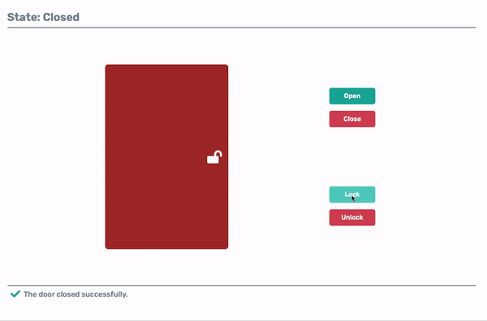
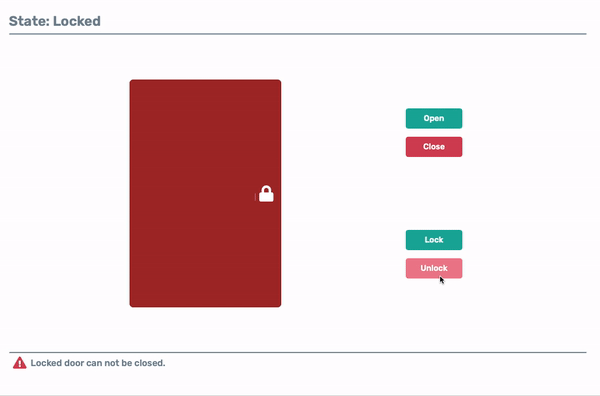
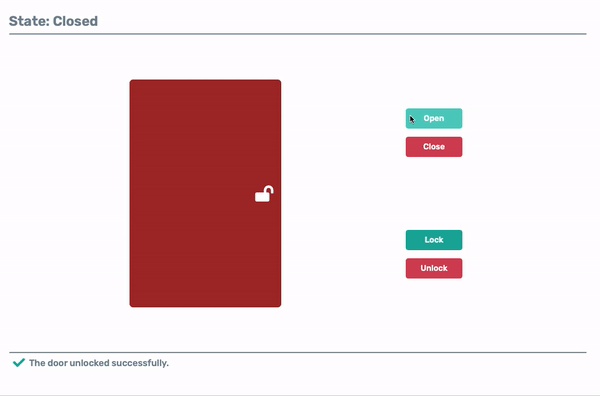

# Door State

BBM467 Course Project Group 10


## Installation 

Needed [Docker](https://www.docker.com/products/docker-desktop).

Run project by using Docker Compose

``` 
docker compose up
```

Open application

``` 
http://localhost:3000/
```
    
## Demo





  
## Tech Stack

**Client:** React

**Server:** Java, Spring Boot, JUnit5

  ## Contributors

* **Güney Kırık(Software Tester, Software Developer, Documenter)** - [LinkedIn](https://www.linkedin.com/in/guneykirik/)
* **Mehmet Sezer(Software Architect, Software Developer)** - [LinkedIn](https://www.linkedin.com/in/mehmetsezerr/)
* **İrem Dereli(Software Project Manager, Software Developer)** -  [LinkedIn](https://www.linkedin.com/in/iremdereli/)
* **Burak Yılmaz(Software Architect, Software Developer)** - [LinkedIn](https://www.linkedin.com/in/burak-yilmaz-b42814171/)
* **M. Emre Kosen(Software Architect, Software Developer)** -  [LinkedIn](https://www.linkedin.com/in/emrekosen/)
